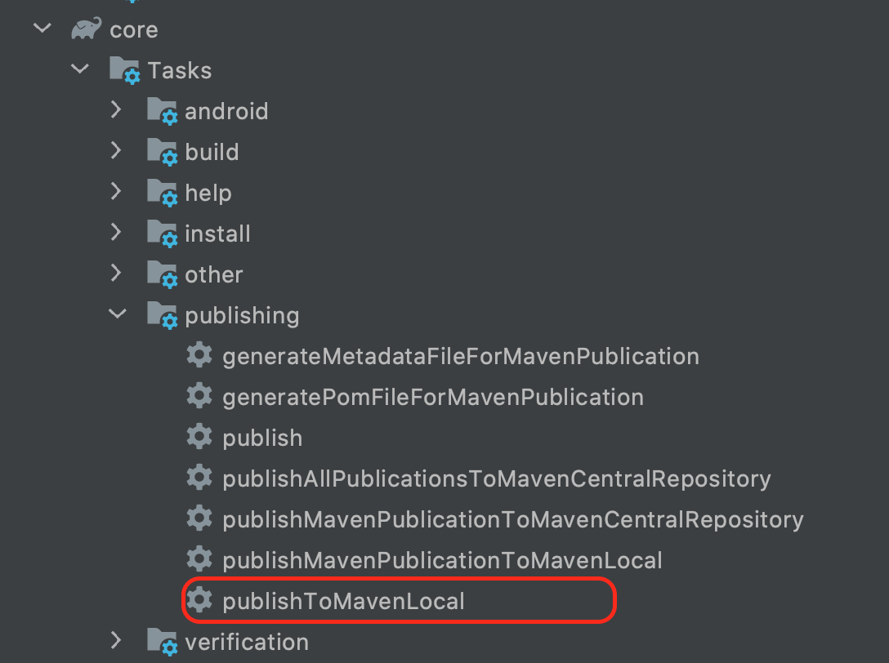
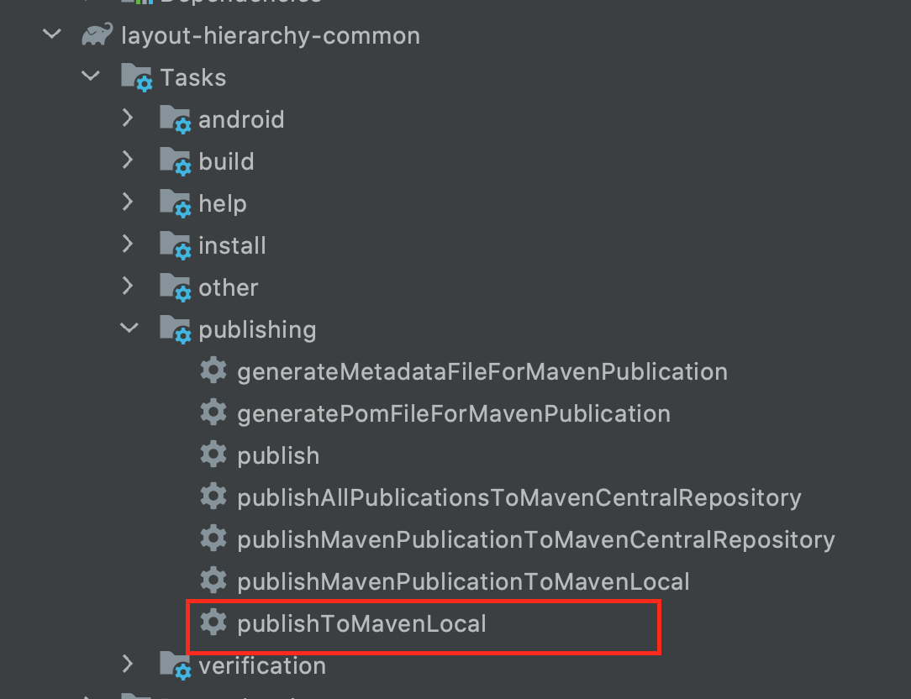
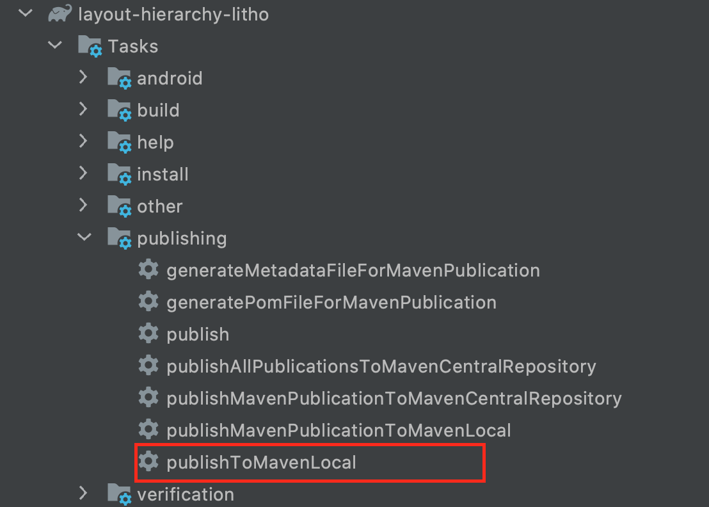
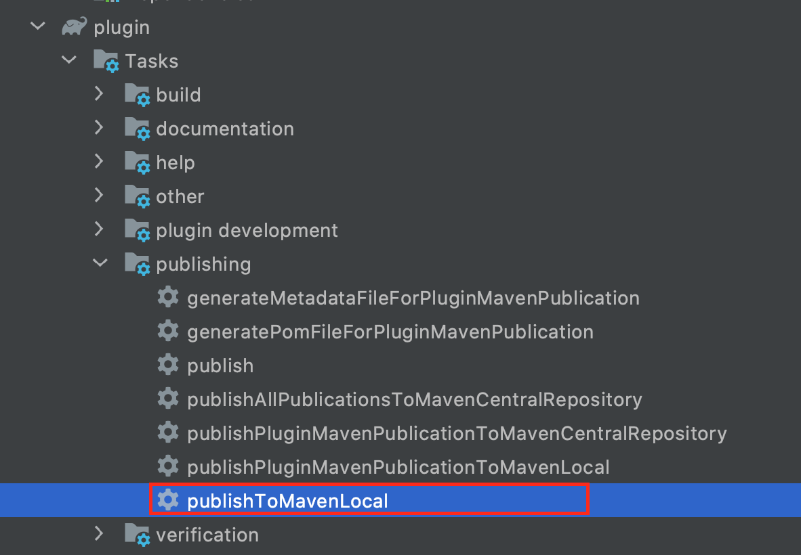
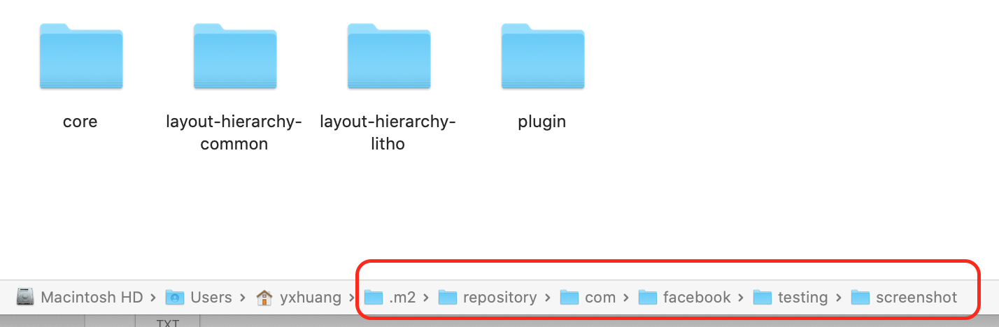

目录
[toc]


这是为了验证本地同样的虚拟机配置，但是生成的 screenshot 图片的 size  不一样的问题。


# 本地构建
- 先将 settings.gradle 中的 sample 屏蔽掉，不参与构建，因为本地还没有 SNAPSHOT 版本，是构建不起来的。

```
include 'core', 'plugin', 'layout-hierarchy-common', 'layout-hierarchy-litho'
//include 'sample'  // 先屏蔽掉
```
- 修改版本,在 gradle.properties 中，修改 VERSION_NAME

```
VERSION_NAME=0.15.111-SNAPSHOT
```

- 构建本地的仓库
依次执行 core, layout-hierarchy-common,layout-hierarchy-litho,plugin 的 `publishToMavanLocal` task， 生成本地代码






 生成之后，会在本地的隐藏文件 ./m2  中显示

 


- sampe 集成本地仓库代码
把 setting.gradle 中的 sample module 放开

```
include 'core', 'plugin', 'layout-hierarchy-common', 'layout-hierarchy-litho'
include 'sample' // 放开
```

sample module 的 build.gradle 的仓库依赖中已经添加了 `mavenLocal` ,估不用修改。

这时候 Sync 项目，应该是可以跑起来了

# 测试

 - 屏蔽多余测试
为了更快的，我已经屏蔽掉多余成 test case, 只有了 MainActivityTest 中的 testScreenshotEntireActivity

- 如果想要验证 verify screenshot 功能，可以去 MainActivity 中，直接修改 textView 的 textColor 

# 模拟器设置
我本地的模拟器配置
机型：Nexus 5x
分辨率: 1080x1920
API: 28
CPU: X86


# 问题

- 问题 1

```
     Caused by: java.lang.NoSuchMethodException: <init> [class android.content.Context, class android.view.Display]
        at java.lang.Class.getConstructor0(Class.java:2327)
        at java.lang.Class.getConstructor(Class.java:1725)
        at com.facebook.testing.screenshot.WindowAttachment.generateAttachInfo(WindowAttachment.java:163)
        at com.facebook.testing.screenshot.WindowAttachment.dispatchAttach(WindowAttachment.java:89) 
        at com.facebook.testing.screenshot.internal.ScreenshotImpl.storeBitmap(ScreenshotImpl.java:182) 
```
解决：

因此输入下面3个命令可以解决

```
adb shell settings put global hidden_api_policy_p_apps 1
adb shell settings put global hidden_api_policy_pre_p_apps 1
adb shell settings put global hidden_api_policy  1
```
参考链接：https://github.com/facebook/screenshot-tests-for-android/issues/224

